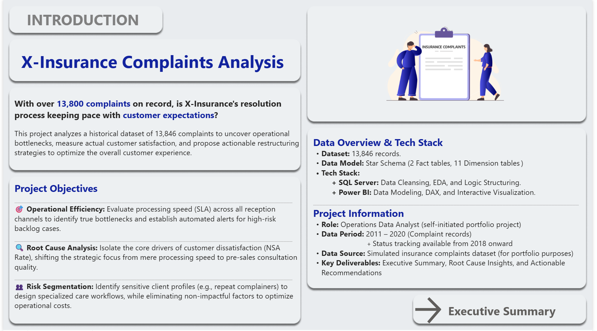
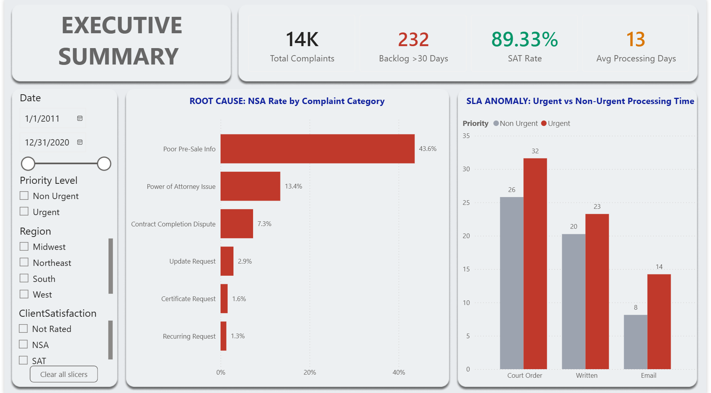
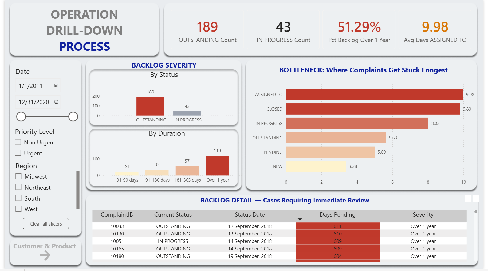
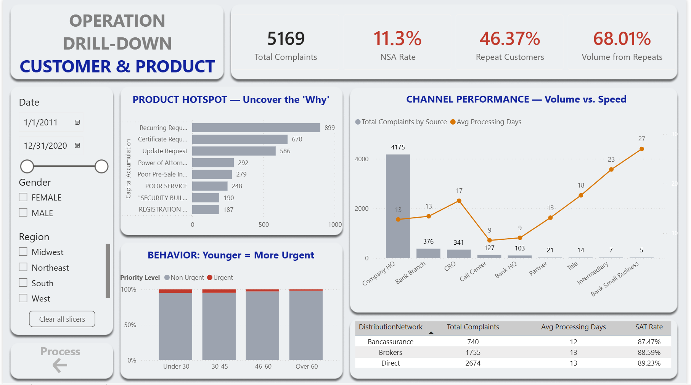

# X-Insurance Complaints Analytics

**Operational deep-dive into 13,846 insurance complaints — uncovering process bottlenecks, the real drivers of customer dissatisfaction, and actionable recommendations for X-Insurance leadership.**


---

## Overview

X-Insurance is a simulated insurance company drowning in complaints. Leadership wants to know: **is the resolution process actually keeping up with customers, and if not, why?**

This project puts me in the role of an **Operations Data Analyst**, tasked with:
- Building a relational data model from raw complaint and status-history data
- Cleaning and validating the dataset — including catching and documenting several real data-quality issues (see below)
- Answering 10 structured business questions using SQL
- Delivering a 4-page interactive Power BI dashboard with an executive summary and two drill-down views
- Translating findings into concrete, prioritized recommendations

> **Disclaimer:** This is a simulated dataset used for portfolio purposes. It does not represent a real insurance company's data.

---

## Table of Contents

- [Project Structure](#project-structure)
- [Data Model](#data-model)
- [Tech Stack](#tech-stack)
- [Data Quality Issues Found](#data-quality-issues-found)
- [The 10 Business Questions](#the-10-business-questions)
- [Key Insights](#key-insights)
- [Dashboard](#dashboard)
- [How to Reproduce](#how-to-reproduce)
- [Phiên bản Tiếng Việt (Vietnamese Version)](#phiên-bản-tiếng-việt)

---

## Project Structure

```text
Insurance Complaints/
├── dashboard/    → Power BI file (InsuranceComplaints.pbix)
├── data/         → Cleaned CSV data files
├── screenshots/  → Exported dashboard images
├── sql/          → SQL scripts for the project:
│   ├── 01_schema_setup.sql              → Schema creation & Data import
│   ├── 02_eda_business_questions.sql    → Queries for the 10 business questions
│   └── 03_create_views.sql              → SQL Views for Power BI modeling
└── README.md
```

---

## Data Model

**Snowflake schema** (commonly referred to as Star Schema in this project's context, with one snowflaked branch):

- **2 Fact tables**
  - `ComplainsData` — one row per complaint (13,846 rows)
  - `StatusHistoryData` — one row per status transition (11,558 rows; tracking starts 2018-09-04, later than the complaint records themselves)
- **10 Dimension tables**: `Customers`, `Brokers`, `Products`, `Regions`, `StateRegions`, `Priorities`, `Statuses`, `Categories`, `Sources`, `Types`
- **1 Date table**: `DimDate` (2011–2020, marked as the model's official date table)

**Data period:** complaint records span **2011-07-08 to 2020-05-14**; status-history tracking is only available from **2018-09-04** onward — this limits how far back the backlog/bottleneck analysis (Questions 4 & 8) can be considered fully representative, and is disclosed explicitly rather than glossed over.

---

## Tech Stack

| Tool | Role |
|---|---|
| **SQL Server** | Data cleansing, exploratory analysis, window functions (`ROW_NUMBER`, `LEAD`), SQL Views encapsulating complex logic (backlog detection, bottleneck duration, repeat-customer counts) |
| **Power BI** | Data modeling, relationships, DAX measures, 4-page interactive dashboard |

SQL was chosen as the primary analysis engine because the source data is inherently relational (multiple dimension tables with foreign keys); complex window-function logic (e.g., detecting the latest status per complaint, measuring time between status transitions) was encapsulated in **SQL Views** rather than reimplemented in DAX, to avoid duplicating and potentially diverging logic between two layers.

---

## Data Quality Issues Found

A significant part of this project was **not trusting the data at face value**. Several issues were discovered, investigated, and documented rather than silently patched:

1. **Sentinel date bug** — `CompletionDate = 1900-01-01` on 50 rows was actually a disguised NULL (an incomplete complaint), caused by a Power Query date-conversion default. Fixed by reassigning to NULL before computing processing time.
2. **`GETDATE()` vs. snapshot date** — early backlog calculations used `GETDATE()`, producing nonsensical results (2,800+ days) because this is historical, not real-time, data. Fixed by using `MAX(StatusDate)` from the dataset itself as the "as-of" reference point.
3. **`ExpectedReimbursement` is 99.91% unusable** — confirmed at the source-file level (not introduced by this analysis) that 13,833 of 13,846 rows are 0. Question 6 (reimbursement vs. satisfaction) was explicitly **not answered** rather than forced with unreliable data — flagged as a data-collection gap for X-Insurance to investigate.
4. **Duplicate-sounding category names** — three distinct categories all start with "DISCLAIMER," risking analytical mix-ups; verified and disambiguated before building dashboard labels.
5. **Same-day status transitions** — `StatusDate` is stored at day-level granularity only, causing many distinct events on the same calendar day to appear as zero-duration transitions in naive `LEAD()` calculations. Filtered out to get an accurate bottleneck measurement (Question 8).
6. **Initial hypothesis rejected** — Question 9 originally assumed Capital Accumulation's high complaint volume reflected product dissatisfaction; drilling into the actual complaint categories showed the top drivers were administrative/procedural requests, not service complaints. The hypothesis was revised based on evidence rather than kept to match the initial assumption.

---

## The 10 Business Questions

| # | Question |
|---|---|
| 1 | Average time to close a complaint, by type and priority |
| 2 | Which complaint category has the highest dissatisfaction (NSA) rate |
| 3 | Does distribution network (Bancassurance/Tele/Direct/Brokers) affect efficiency |
| 4 | How many complaints are backlogged (IN PROGRESS/OUTSTANDING) beyond 30 days |
| 5 | Which region has the highest complaints-per-1,000-customers |
| 6 | Correlation between expected reimbursement and satisfaction |
| 7 | Which intake channel resolves complaints fastest |
| 8 | Which status causes the longest delay before transitioning |
| 9 | Which product category generates the most complaints |
| 10 | Demographic profile of customers filing "Urgent" complaints |

Full SQL queries are in [`sql/`](./sql).

---

## Key Insights

- **Distribution network and region are not the problem** — both show negligible variance across categories, ruling out two common (but ultimately wrong) hypotheses.
- **"Urgent" complaints are processed *slower* than "Non-Urgent" ones** through paper/legal channels (Court Order, Written, Email) — a 3–6 day reversal of the intended priority system.
- **232 complaints (1.68%) are backlogged past 30 days**, 81.5% of which sit in `OUTSTANDING` — meaning they were never assigned, not that they're processing slowly. 51% have been stuck for over a year.
- **The real driver of dissatisfaction isn't processing speed** — it's pre-sale consultation quality (`Poor Information Before/With The Sale` accounts for the largest absolute number of dissatisfied customers).
- **46.3% of customers are repeat complainants**, but they generate **68% of total complaint volume** — a clear Pareto effect pointing to a need for specialized escalation handling.
- **Urgency perception declines steadily with age** — from 4.55% (under 30) to 1.45% (over 60), a 3x spread.

---

## Dashboard

This 4-page Power BI report is designed to guide stakeholders from a high-level overview down to granular, case-level action items.

### 1. Introduction
Project framing, objectives, tech stack, and data scope.


### 2. Executive Summary
Top-line KPIs, root-cause analysis (NSA rate), and SLA anomalies.


### 3. Operation Drill-Down (Process)
Backlog severity, bottleneck tracking by status, and a case-level detail table for immediate action.


### 4. Operation Drill-Down (Customer & Product)
Product hotspots, channel performance, age-group behavior, and the repeat-customer Pareto effect.


> **Interactive Version:** Open [`dashboard/InsuranceComplaints.pbix`](./dashboard) in Power BI Desktop to interact with the full dashboard (filters, tooltips, drill-downs).

---

## How to Reproduce

1. Restore the SQL Server database using the schema in [`sql/01_schema_setup.sql`](./sql).
2. Load the cleaned CSVs from [`data/`](./data) into the corresponding tables (staging-table pattern recommended — see comments in the schema script).
3. Run the views and query scripts in [`sql/`](./sql) to reproduce the 10-question analysis.
4. Open [`dashboard/InsuranceComplaints.pbix`](./dashboard) in Power BI Desktop, update the SQL Server data source connection to your local instance, and refresh.

---

## Author


**HUYNH XUAN THIEN** — Information Systems student (Faculty of Information Technology) at Saigon University. Self-initiated portfolio project built to demonstrate SQL, data modeling, data processing, and visualization skills for Data Analyst and Data Engineer roles.

**📫 Contact:** [huynhxuanthien0401@gmail.com](mailto:huynhxuanthien0401@gmail.com) | 0398811258 | [LinkedIn Profile](https://www.linkedin.com/in/huynh-xuan-thien-95165030b/)

---


## Phiên bản Tiếng Việt

<details>
<summary><strong>📖 Click để xem README chi tiết bằng Tiếng Việt</strong></summary>

### Tổng quan

X-Insurance là một công ty bảo hiểm mô phỏng đang gặp vấn đề với khối lượng khiếu nại lớn. Ban lãnh đạo muốn biết: **quy trình xử lý hiện tại có đang theo kịp khách hàng không, và nếu không thì vì sao?**

Project này đặt tôi vào vai trò **Chuyên viên Phân tích Dữ liệu Vận hành (Operations Data Analyst)**, với nhiệm vụ:
- Xây dựng mô hình dữ liệu quan hệ từ dữ liệu khiếu nại và lịch sử trạng thái thô
- Làm sạch và kiểm chứng dữ liệu — bao gồm phát hiện và ghi lại nhiều vấn đề dữ liệu thực tế (xem bên dưới)
- Trả lời 10 câu hỏi kinh doanh cấu trúc bằng SQL
- Xây dựng dashboard Power BI tương tác 4 trang gồm executive summary và 2 trang drill-down
- Chuyển hóa phát hiện thành khuyến nghị hành động cụ thể, có ưu tiên

> **Lưu ý:** Đây là bộ dữ liệu mô phỏng dùng cho mục đích portfolio, không đại diện cho dữ liệu thật của bất kỳ công ty bảo hiểm nào.

### Cấu trúc thư mục

```text
Insurance Complaints/
├── dashboard/    → File Power BI (InsuranceComplaints.pbix)
├── data/         → Dữ liệu CSV đã làm sạch
├── screenshots/  → Ảnh chụp các trang dashboard
├── sql/          → Các script SQL cho project:
│   ├── 01_schema_setup.sql              → Khởi tạo schema & nạp dữ liệu
│   ├── 02_eda_business_questions.sql    → Truy vấn cho 10 câu hỏi kinh doanh
│   └── 03_create_views.sql              → Các SQL View phục vụ Power BI model
└── README.md
```
### Mô hình dữ liệu

**Snowflake Schema** (thường gọi là Star Schema trong ngữ cảnh project này, có 1 nhánh dạng snowflake):

- **2 bảng Fact**
  - `ComplainsData` — 1 dòng/khiếu nại (13.846 dòng)
  - `StatusHistoryData` — 1 dòng/lần chuyển trạng thái (11.558 dòng; dữ liệu chỉ bắt đầu từ 04/09/2018, muộn hơn nhiều so với dữ liệu khiếu nại)
- **10 bảng Dimension**: `Customers`, `Brokers`, `Products`, `Regions`, `StateRegions`, `Priorities`, `Statuses`, `Categories`, `Sources`, `Types`
- **1 bảng Date**: `DimDate` (2011–2020, đánh dấu là Date table chính thức của model)

**Khung thời gian dữ liệu:** khiếu nại trải dài từ **08/07/2011 đến 14/05/2020**; lịch sử trạng thái chỉ có từ **04/09/2018** trở đi — điều này giới hạn mức độ đại diện của phân tích Backlog/Bottleneck (câu 4, 8) cho toàn bộ giai đoạn, và được công bố rõ ràng thay vì che giấu.

### Công cụ sử dụng

| Công cụ | Vai trò |
|---|---|
| **SQL Server** | Làm sạch dữ liệu, phân tích khám phá (EDA), window function (`ROW_NUMBER`, `LEAD`), đóng gói logic phức tạp vào SQL View (phát hiện backlog, tính thời gian bottleneck, đếm khách hàng khiếu nại lặp lại) |
| **Power BI** | Dựng model dữ liệu, quan hệ, đo lường DAX, dashboard tương tác 4 trang |

SQL được chọn làm công cụ phân tích chính vì dữ liệu nguồn vốn có cấu trúc quan hệ (nhiều bảng dimension liên kết khóa ngoại); các logic window-function phức tạp (tìm trạng thái mới nhất của mỗi khiếu nại, đo thời gian giữa các lần chuyển trạng thái) được đóng gói vào **SQL View** thay vì viết lại bằng DAX, để tránh trùng lặp và có nguy cơ lệch logic giữa 2 tầng.

### Các vấn đề dữ liệu đã phát hiện

Một phần quan trọng của project này là **không tin tưởng dữ liệu ngay từ đầu**. Nhiều vấn đề đã được phát hiện, điều tra và ghi lại thay vì âm thầm sửa cho qua:

1. **Lỗi ngày sentinel** — `CompletionDate = 1900-01-01` ở 50 dòng thực chất là NULL bị ngụy trang (khiếu nại chưa hoàn thành), do lỗi convert ngày mặc định trong Power Query. Đã sửa bằng cách gán lại NULL trước khi tính thời gian xử lý.
2. **`GETDATE()` vs. ngày snapshot** — phần tính Backlog ban đầu dùng `GETDATE()`, cho kết quả vô lý (2.800+ ngày) vì đây là dữ liệu lịch sử, không phải real-time. Đã sửa bằng cách dùng `MAX(StatusDate)` từ chính dataset làm mốc "hiện tại".
3. **`ExpectedReimbursement` không dùng được (99,91% lỗi)** — đã xác minh ngay ở cấp độ file nguồn (không phải lỗi phát sinh trong quá trình phân tích) rằng 13.833/13.846 dòng bằng 0. Câu 6 (tương quan bồi thường vs hài lòng) được **chủ động không đưa ra kết luận** thay vì ép dùng dữ liệu không đáng tin — báo cáo như một lỗ hổng thu thập dữ liệu cần X-Insurance rà soát.
4. **Tên category dễ gây nhầm lẫn** — 3 category khác nhau đều bắt đầu bằng "DISCLAIMER", có nguy cơ nhầm lẫn khi phân tích; đã xác minh và phân biệt rõ trước khi đưa vào nhãn dashboard.
5. **Chuyển trạng thái cùng ngày** — `StatusDate` chỉ lưu ở độ chính xác cấp ngày, khiến nhiều sự kiện khác nhau trong cùng 1 ngày bị hiểu nhầm thành "chuyển trạng thái tức thời" khi dùng `LEAD()` thô. Đã lọc bỏ để có kết quả bottleneck chính xác (câu 8).
6. **Giả thuyết ban đầu bị bác bỏ** — câu 9 ban đầu giả định khối lượng khiếu nại cao của Capital Accumulation phản ánh sự bất mãn sản phẩm; khi đào sâu vào category thật, top nguyên nhân lại là yêu cầu hành chính/thủ tục, không phải khiếu nại dịch vụ. Giả thuyết đã được điều chỉnh dựa trên bằng chứng, không giữ nguyên cho khớp với giả định ban đầu.

### 10 câu hỏi kinh doanh

| # | Câu hỏi |
|---|---|
| 1 | Thời gian trung bình đóng 1 khiếu nại, theo loại và mức ưu tiên |
| 2 | Danh mục khiếu nại nào có tỷ lệ không hài lòng (NSA) cao nhất |
| 3 | Mạng lưới phân phối (Bancassurance/Tele/Direct/Brokers) có ảnh hưởng tới hiệu suất không |
| 4 | Có bao nhiêu khiếu nại bị tồn đọng (IN PROGRESS/OUTSTANDING) quá 30 ngày |
| 5 | Khu vực nào có số khiếu nại/1.000 khách hàng cao nhất |
| 6 | Tương quan giữa số tiền bồi thường kỳ vọng và sự hài lòng |
| 7 | Kênh tiếp nhận nào xử lý khiếu nại nhanh nhất |
| 8 | Trạng thái nào gây chậm trễ lâu nhất trước khi chuyển bước |
| 9 | Danh mục sản phẩm nào tạo ra nhiều khiếu nại nhất |
| 10 | Chân dung nhân khẩu học của khách hàng gửi khiếu nại "Urgent" |

Toàn bộ query SQL nằm trong [`sql/`](./sql).

### Insight chính

- **Mạng lưới phân phối và khu vực địa lý không phải nguyên nhân** — cả 2 đều cho thấy chênh lệch không đáng kể giữa các nhóm, loại bỏ 2 giả thuyết phổ biến (nhưng sai) ban đầu.
- **Khiếu nại "Urgent" lại được xử lý CHẬM HƠN "Non-Urgent"** qua các kênh giấy tờ/pháp lý (Court Order, Written, Email) — nghịch đảo 3-6 ngày so với ý nghĩa ưu tiên vốn có.
- **232 khiếu nại (1,68%) bị tồn đọng quá 30 ngày**, 81,5% trong số đó nằm ở `OUTSTANDING` — nghĩa là chưa từng được phân công, không phải đang xử lý chậm. 51% đã kẹt hơn 1 năm.
- **Nguyên nhân bất mãn thật sự không phải tốc độ xử lý** — mà là chất lượng tư vấn trước bán hàng (`Poor Information Before/With The Sale` chiếm số lượng khách bất mãn tuyệt đối lớn nhất).
- **46,3% khách hàng là khiếu nại lặp lại**, nhưng tạo ra **68% tổng khối lượng khiếu nại** — hiệu ứng Pareto rõ rệt, cần cơ chế xử lý escalation riêng.
- **Xu hướng đánh giá "khẩn cấp" giảm đều theo tuổi** — từ 4,55% (dưới 30) xuống 1,45% (trên 60), chênh lệch gấp 3 lần.

### Dashboard

Báo cáo Power BI 4 trang này được thiết kế để dẫn dắt người xem từ bức tranh tổng quan đến các hành động xử lý cụ thể ở cấp độ từng ca khiếu nại.

**1. Introduction**
Bối cảnh project, mục tiêu, tech stack, và phạm vi dữ liệu.


**2. Executive Summary**
KPI tổng quan, phân tích nguyên nhân gốc rễ (Tỷ lệ NSA), và các bất thường về SLA.


**3. Operation Drill-Down (Process)**
Mức độ nghiêm trọng của backlog, theo dõi điểm nghẽn (bottleneck) theo trạng thái, và bảng chi tiết từng case để xử lý ngay lập tức.


**4. Operation Drill-Down (Customer & Product)**
Điểm nóng sản phẩm, hiệu suất kênh tiếp nhận, hành vi theo nhóm tuổi, và hiệu ứng Pareto của tệp khách hàng khiếu nại lặp lại.


> **Bản tương tác:** Mở file [`dashboard/InsuranceComplaints.pbix`](./dashboard) bằng Power BI Desktop để trải nghiệm toàn bộ dashboard (lọc, tooltips, drill-downs).


### Cách tái tạo lại project

1. Khôi phục database SQL Server theo schema trong [`sql/01_schema_setup.sql`](./sql).
2. Nạp các file CSV đã làm sạch từ [`data/`](./data) vào đúng bảng tương ứng (khuyến nghị dùng pattern staging-table — xem chú thích trong script schema).
3. Chạy các View và script query trong [`sql/`](./sql) để tái tạo lại phân tích 10 câu hỏi.
4. Mở [`dashboard/InsuranceComplaints.pbix`](./dashboard) bằng Power BI Desktop, cập nhật lại kết nối SQL Server về đúng instance local của bạn, rồi Refresh.

### Tác giả

**HUỲNH XUÂN THIỆN** — Sinh viên ngành Hệ thống Thông tin (Khoa Công nghệ Thông tin), Đại học Sài Gòn. Project cá nhân tự thực hiện nhằm thể hiện kỹ năng SQL, Data Modeling, xử lý dữ liệu và trực quan hóa cho các vị trí Data Analyst và Data Engineer.

**📫 Liên hệ:** [huynhxuanthien0401@gmail.com](mailto:huynhxuanthien0401@gmail.com) | 0398811258 | [LinkedIn Profile](https://www.linkedin.com/in/huynh-xuan-thien-95165030b/)


</details>
