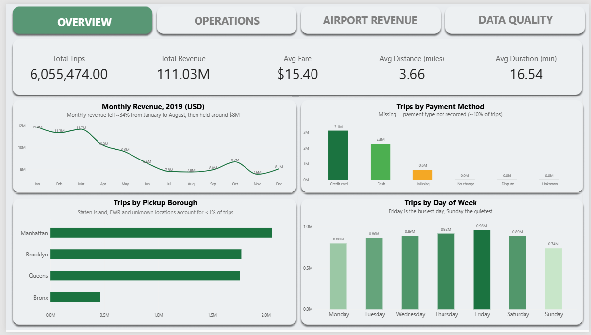
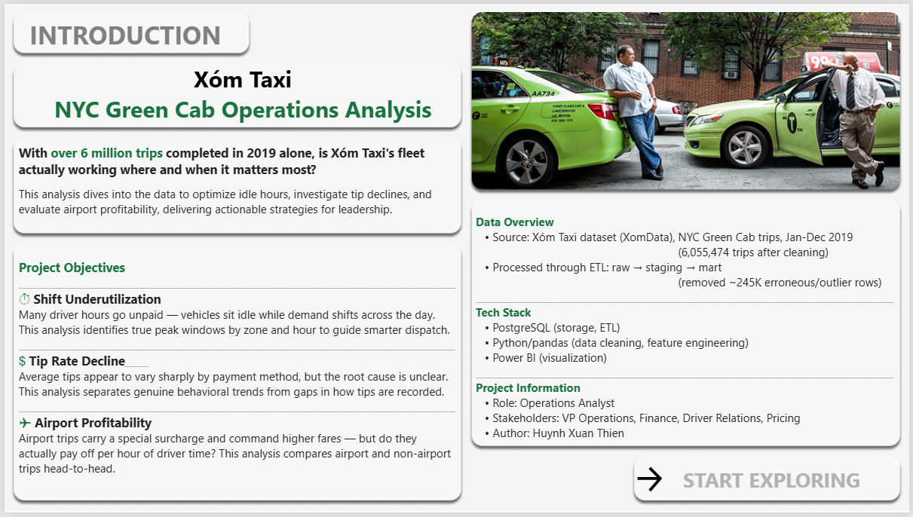
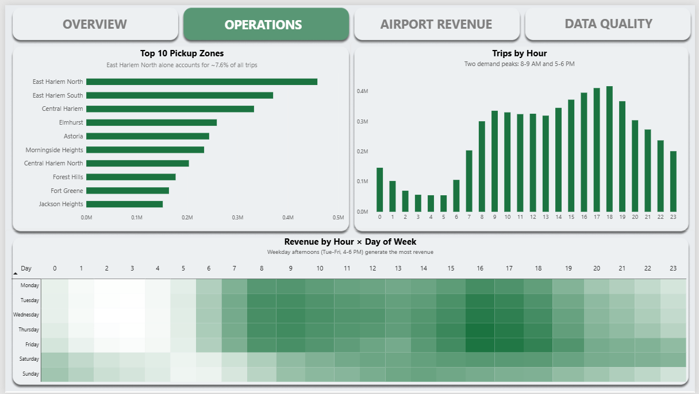
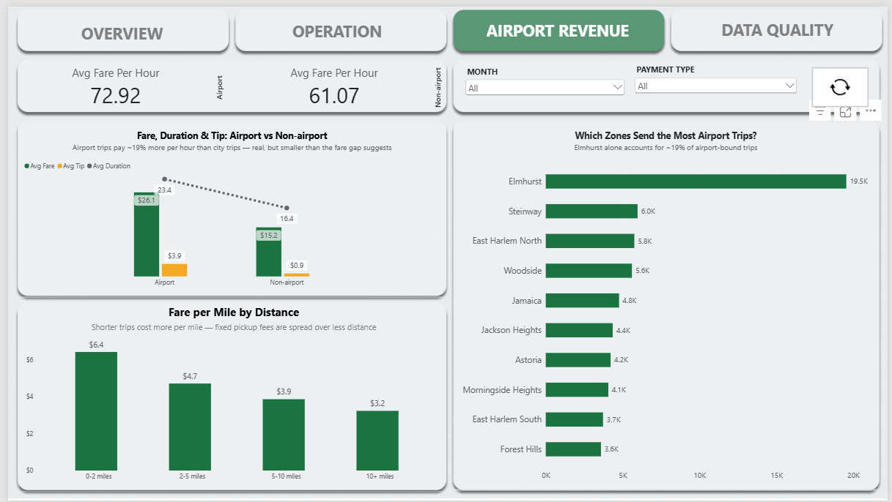
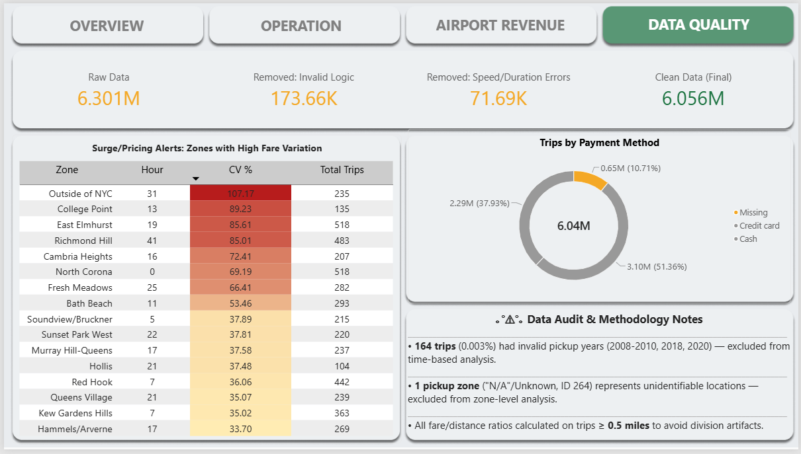

# Xóm Taxi: NYC Green Cab Operations Analysis


With over 6 million trips completed in 2019 alone, is Xóm Taxi's fleet actually working where and when it matters most?

This project analyzes 6,055,474 NYC Green Taxi trips to uncover where driver hours are being wasted, whether declining tips reflect a real customer trend or a data collection gap, and whether airport trips are as profitable as their surcharges suggest. The result is a set of concrete, data-backed recommendations for Operations, Finance, and Pricing leadership — plus a fully interactive Power BI dashboard.



**[Browse the SQL analysis →](sql/03_business_questions.sql) | [View the ETL pipeline →](sql/01_raw_to_staging_pipeline.sql) | [See all 5 dashboard pages →](#dashboard)**

---

## Business Context

Xóm Taxi operates ~5,000 vehicles serving Brooklyn, Queens, Bronx, Staten Island and outer Manhattan — the boroughs outside Yellow Taxi's traditional territory. Drivers are gig workers splitting fare revenue with the company, which also earns dispatch fees.

Leadership raised three pain points this project set out to address:

| Pain Point | Owner | Status |
|---|---|---|
| **Shift underutilization** — many hours spent driving empty | VP Operations | Peak windows identified by zone and hour (Operations page) |
| **Tip rate decline** — unclear which segment is responsible | Head of Driver Relations | Root cause isolated: data collection gap, not customer behavior |
| **Airport trip profitability** — unclear if the surcharge pays off | Head of Finance | Confirmed profitable, but margin is smaller than fare alone suggests |

---

## Dataset

- **Source:** NYC Green Taxi trip records (via XomData), covering trips, pickup/dropoff zones, and payment types
- **Volume:** 6,300,985 raw trips, primarily January–December 2019
- **Final clean dataset:** 6,055,474 trips (99.6% retained) after removing invalid and anomalous records

---

## Architecture: Raw → Staging → Mart

```
CSV (SQL Server export)
    │
    ▼
┌─────────┐   type casting, NULL handling     ┌──────────┐   outlier removal,        ┌──────┐
│   raw   │ ─────────────────────────────────▶│ staging  │ ─────────────────────────▶│ mart │
└─────────┘   (all columns as TEXT)            └──────────┘   feature engineering      └──────┘
                                                                (Python/pandas)
```

- **`raw`** — trip data loaded as-is (all `TEXT` columns), no constraints. Preserves the original export exactly, so every downstream decision can be traced back to source data.
- **`staging`** — proper data types (`NUMERIC`, `TIMESTAMP`, etc.), NULLs resolved, rows with impossible values removed (negative fares, zero distance, dropoff before pickup).
- **`mart`** — outliers removed via statistical (IQR) and domain-knowledge thresholds, engineered features added (`avg_speed_mph`, `pickup_hour`, `is_peak_hour`, `trip_category`, `pickup_dayofweek`), loaded back from Python via `to_sql()`.

**To reproduce:** run `sql/01_raw_to_staging_pipeline.sql` → `python/db_to_parquet_template.py` → `sql/02_mart_cleaning.sql` → `sql/04_surge_alerts_view.sql`, in that order. The Python script rebuilds `mart.trips` from scratch (`if_exists='replace'`), so `02_mart_cleaning.sql` must always be re-run after it.

---

## Tech Stack

| Layer | Tool | Role |
|---|---|---|
| Storage & ETL | **PostgreSQL** | `raw` → `staging` → `mart` pipeline, all 15 business-question queries |
| Processing | **Python** (pandas, SQLAlchemy) | Outlier detection, feature engineering, load-back to Postgres |
| Visualization | **Power BI** | 5-page interactive dashboard, DAX measures |
| Version Control | **Git / GitHub** | This repo |

---

## Data Cleaning Summary

| Step | Rows removed | Reason |
|---|---|---|
| Raw → Staging | 173,660 | Negative fare, zero distance, dropoff ≤ pickup |
| Staging → Mart (Python) | 38,243 | Implausible speed (>100 mph, caused by near-zero duration) |
| Mart cleanup (`02_mart_cleaning.sql`) | 33,444 | Trips under 1 minute (likely GPS/meter errors) |
| **Total removed** | **245,347 (3.9%)** | |
| **Final dataset** | **6,055,474** (within 2019) | |

Every removal decision is documented with its rationale in [`sql/01_raw_to_staging_pipeline.sql`](sql/01_raw_to_staging_pipeline.sql) and [`sql/02_mart_cleaning.sql`](sql/02_mart_cleaning.sql) — including cases where data was **kept** despite looking unusual (e.g. missing `passenger_count` was imputed rather than dropped, since dropping it would have discarded 10.7% of otherwise valid trips).

---

## Key Insights

**Revenue fell ~34% from January to August 2019**, then partially recovered in Q4. Driven by seasonality, demand drop, or both — flagged for further investigation with multi-year data.

**Demand peaks twice daily** (8–9 AM, 4–6 PM) and concentrates in Upper Manhattan, with East Harlem North alone accounting for ~7.6% of all trips. One notable exception: Central Harlem North peaks in the morning, breaking the citywide pattern.

**Airport trips are profitable, but less than fare alone suggests.** Airport rides earn ~$72.92/hour versus ~$61.07/hour for city trips (~19% more) — a smaller gap than the raw fare difference ($26.1 vs $15.2, ~72% more) implies, since airport trips also take longer.

**Tip rate differences by payment method are a measurement artifact, not a behavior difference.** Cash tips aren't captured electronically, so comparing "Credit card: 16.1% tip rate" against "Cash: ~0%" would be misleading — both groups may tip similarly in practice.

**10.6% of trips have no recorded payment type.** This group's near-zero tip rate matches the Cash pattern, suggesting most of these are misclassified cash trips rather than a distinct payment method.

**Fare per mile decreases as trip distance increases** — confirming the meter is not a flat rate; short trips carry proportionally more of the fixed flag-drop fee.

Full question-by-question analysis — methodology, SQL, insight, and business recommendation for all 15 business questions — is in [`sql/03_business_questions.sql`](sql/03_business_questions.sql).

---

## Dashboard

5 pages, each built for a specific stakeholder:

| Page | Audience | Key visuals |
|---|---|---|
| **Introduction** | All | Project context, objectives, data overview |
| **Overview** | All | KPIs, monthly revenue trend, payment mix, trips by borough/day |
| **Operations** | VP Operations, Dispatch | 24×7 revenue heatmap, peak hour by zone |
| **Airport Revenue** | Finance | Fare-per-hour comparison, fare-per-mile by distance bucket |
| **Data Quality** | All (technical appendix) | Cleaning summary, surge-pricing alerts, known data limitations |







Full interactive file: [`dashboard/NYC_GREEN_TAXI.pbix`](dashboard/NYC_GREEN_TAXI.pbix) (requires Power BI Desktop).

---

## Known Limitations

- **Single year of data (2019)** — trends described as "declining" or "peak" are observed patterns, not confirmed multi-year trends. Flagged explicitly wherever relevant.
- **No supply-side data** — the dataset only records completed trips, not vehicle availability. Recommendations about dispatch are based on demand patterns alone; confirming actual driver shortage requires fleet data not available here.
- **Cash tips are not captured** — any tip-rate comparison involving non-card payments should be treated as a data-quality finding, not a behavioral insight.
- **Surge-pricing flags (Q15) are statistical candidates, not confirmed events** — most flagged zone/hour combinations have low trip volume; only cases with sufficient sample size (e.g. North Corona, 518 trips) are reliable enough to investigate further.

---

## Project Structure

```
sql/
  01_raw_to_staging_pipeline.sql   ETL: CSV → raw → staging
  02_mart_cleaning.sql             Removes too-short trips from mart.trips
  03_business_questions.sql        15 business questions, full insight + recommendation
  04_surge_alerts_view.sql         Builds mart.surge_alerts for the dashboard

python/
  db_to_parquet_template.py        Staging → mart: outlier removal, feature engineering, load to Postgres
  taxi_etl_analysis.ipynb          Exploratory analysis behind the Python pipeline

dashboard/
  NYC_GREEN_TAXI.pbix              Power BI report (5 pages)
  images/                          Assets used inside the report

screenshots/                       Page-by-page exports, used above

data/dataset/                      Raw CSVs and cached Parquet files (not committed — see .gitignore)
```

**Note on data files:** raw CSVs and `.parquet` caches are excluded from version control (see `.gitignore`) — they're too large for a code repository. Source data available via XomData. To rebuild them locally, follow the reproduction steps above.

**Note on credentials:** `db_to_parquet_template.py` reads its database connection string from the `TAXI_DB_URL` environment variable (falls back to a local default). Set this before running — never hardcode real credentials in committed code.

---

## Author

Huỳnh Xuân Thiện — Operations Analyst (project), aspiring Data Analyst

**📫 Contact:** [huynhxuanthien0401@gmail.com](mailto:huynhxuanthien0401@gmail.com) | 0398811258 | [LinkedIn Profile](https://www.linkedin.com/in/huynh-xuan-thien-95165030b/)


<details>
<summary>🇻🇳 Phiên bản Tiếng Việt</summary>

# Xóm Taxi: Phân tích vận hành NYC Green Cab

Với hơn 6 triệu chuyến đi hoàn thành chỉ riêng năm 2019, đội xe của Xóm Taxi có thực sự hoạt động đúng nơi, đúng lúc cần nhất không?

Dự án này phân tích 6,055,474 chuyến đi Green Taxi NYC để tìm ra: giờ nào tài xế đang chạy xe rỗng lãng phí, việc tip giảm có phải xu hướng khách hàng thật hay chỉ là lỗ hổng trong cách ghi nhận dữ liệu, và các chuyến đi sân bay có thực sự sinh lời như phụ phí của chúng gợi ý hay không. Kết quả là một bộ khuyến nghị cụ thể, dựa trên dữ liệu, dành cho lãnh đạo Vận hành, Tài chính và Định giá — cùng một dashboard Power BI tương tác hoàn chỉnh.


## Bối cảnh kinh doanh

Xóm Taxi vận hành ~5.000 xe phục vụ Brooklyn, Queens, Bronx, Staten Island và vùng ngoại vi Manhattan — các khu vực nằm ngoài địa bàn truyền thống của Yellow Taxi. Tài xế là lao động tự do (gig worker), chia phần trăm doanh thu cước phí với công ty, công ty thu thêm phí điều phối.

Ban lãnh đạo đặt ra 3 vấn đề mà dự án này hướng đến giải quyết:

| Vấn đề | Người phụ trách | Kết quả |
|---|---|---|
| **Xe chạy rỗng nhiều giờ** — cần tối ưu điều phối | VP Operations | Đã xác định khung giờ cao điểm theo khu vực và giờ trong ngày |
| **Tỷ lệ tip giảm** — chưa rõ nhóm khách nào | Head of Driver Relations | Xác định nguyên nhân gốc: lỗ hổng ghi nhận dữ liệu, không phải hành vi khách hàng |
| **Lợi nhuận chuyến sân bay** — chưa rõ phụ phí có đáng không | Head of Finance | Xác nhận có lời, nhưng biên lợi nhuận thấp hơn nhiều so với chỉ nhìn giá cước |

## Bộ dữ liệu

- **Nguồn:** Dữ liệu chuyến đi NYC Green Taxi (qua XomData), gồm thông tin chuyến đi, khu vực đón/trả khách, hình thức thanh toán
- **Khối lượng:** 6.300.985 chuyến thô, chủ yếu từ tháng 1–12/2019
- **Dữ liệu sạch cuối cùng:** 6.055.474 chuyến (giữ lại 99,6%) sau khi loại bỏ dữ liệu không hợp lệ và bất thường

## Kiến trúc: Raw → Staging → Mart

- **`raw`** — dữ liệu thô giữ nguyên bản (toàn bộ cột kiểu `TEXT`), không ràng buộc. Bảo toàn đúng dữ liệu export gốc để mọi quyết định xử lý sau này đều truy vết lại được.
- **`staging`** — ép đúng kiểu dữ liệu, xử lý NULL, loại bỏ các dòng có giá trị vô lý (giá âm, quãng đường bằng 0, giờ trả trước giờ đón).
- **`mart`** — loại bỏ outlier bằng thống kê (IQR) và ngưỡng thực tế, bổ sung các cột tính toán (`avg_speed_mph`, `pickup_hour`, `is_peak_hour`, `trip_category`, `pickup_dayofweek`), nạp lại từ Python qua `to_sql()`.

**Để tái lập:** chạy `sql/01_raw_to_staging_pipeline.sql` → `python/db_to_parquet_template.py` → `sql/02_mart_cleaning.sql` → `sql/04_surge_alerts_view.sql`, đúng thứ tự này. Script Python tạo lại toàn bộ `mart.trips` từ đầu (`if_exists='replace'`), nên luôn phải chạy lại `02_mart_cleaning.sql` sau đó.

## Công nghệ sử dụng

| Tầng | Công cụ | Vai trò |
|---|---|---|
| Lưu trữ & ETL | **PostgreSQL** | Pipeline `raw` → `staging` → `mart`, toàn bộ 15 câu hỏi phân tích |
| Xử lý | **Python** (pandas, SQLAlchemy) | Phát hiện outlier, tạo đặc trưng, nạp lại Postgres |
| Trực quan hóa | **Power BI** | Dashboard 5 trang, DAX measure |
| Quản lý phiên bản | **Git / GitHub** | Repo này |

## Tóm tắt làm sạch dữ liệu

| Bước | Số dòng loại bỏ | Lý do |
|---|---|---|
| Raw → Staging | 173.660 | Giá âm, quãng đường bằng 0, giờ trả ≤ giờ đón |
| Staging → Mart (Python) | 38.243 | Tốc độ ảo (>100 mph, do thời gian chuyến gần bằng 0) |
| Dọn dẹp Mart (`02_mart_cleaning.sql`) | 33.444 | Chuyến dưới 1 phút (khả năng lỗi GPS/thiết bị) |
| **Tổng loại bỏ** | **245.347 (3,9%)** | |
| **Dữ liệu cuối cùng** | **6.055.474** (trong năm 2019) | |

Mỗi quyết định loại bỏ đều có lý giải cụ thể trong [`sql/01_raw_to_staging_pipeline.sql`](sql/01_raw_to_staging_pipeline.sql) và [`sql/02_mart_cleaning.sql`](sql/02_mart_cleaning.sql) — kể cả những trường hợp **giữ lại** dữ liệu dù trông bất thường (ví dụ `passenger_count` rỗng được gán giá trị mặc định thay vì xóa, vì xóa sẽ mất oan 10,7% dữ liệu vẫn hợp lệ).

## Những phát hiện chính

**Doanh thu giảm khoảng 34% từ tháng 1 đến tháng 8/2019**, sau đó phục hồi một phần vào quý 4. Nguyên nhân có thể do yếu tố mùa vụ, nhu cầu giảm, hoặc cả hai — cần thêm dữ liệu nhiều năm để xác nhận.

**Nhu cầu đạt đỉnh 2 lần mỗi ngày** (8–9h sáng, 16–18h chiều) và tập trung ở Upper Manhattan, riêng East Harlem North chiếm ~7,6% tổng số chuyến. Một ngoại lệ đáng chú ý: Central Harlem North đạt đỉnh vào buổi sáng, khác với pattern chung toàn thành phố.

**Chuyến đi sân bay có lời, nhưng thấp hơn mức giá cước gợi ý.** Chuyến sân bay kiếm được ~$72.92/giờ so với ~$61.07/giờ của chuyến trong thành phố (cao hơn ~19%) — chênh lệch nhỏ hơn nhiều so với mức chênh giá cước thô ($26.1 so với $15.2, cao hơn ~72%), vì chuyến sân bay cũng mất nhiều thời gian hơn.

**Chênh lệch tỷ lệ tip theo hình thức thanh toán là do cách đo lường, không phải khác biệt hành vi.** Tip tiền mặt không được ghi nhận qua hệ thống điện tử, nên so sánh "Thẻ: tỷ lệ tip 16,1%" với "Tiền mặt: ~0%" sẽ gây hiểu lầm — thực tế cả 2 nhóm có thể tip tương đương nhau.

**10,6% chuyến không có hình thức thanh toán được ghi nhận.** Nhóm này có tỷ lệ tip gần bằng 0, giống hệt pattern của nhóm Tiền mặt — gợi ý phần lớn đây là các chuyến trả tiền mặt bị lỗi ghi nhận, không phải 1 hình thức thanh toán riêng biệt.

**Giá cước trên mỗi dặm giảm dần khi quãng đường tăng** — xác nhận đồng hồ tính tiền không phải mức giá cố định; chuyến ngắn phải gánh tỷ trọng lớn hơn của phí mở cửa cố định.

Phân tích đầy đủ 15 câu hỏi kinh doanh — phương pháp, SQL, insight và khuyến nghị — nằm trong [`sql/03_business_questions.sql`](sql/03_business_questions.sql).

## Dashboard

5 trang, mỗi trang phục vụ 1 nhóm đối tượng cụ thể:

| Trang | Đối tượng | Nội dung chính |
|---|---|---|
| **Introduction** | Tất cả | Bối cảnh dự án, mục tiêu, tổng quan dữ liệu |
| **Overview** | Tất cả | KPI, xu hướng doanh thu theo tháng, cơ cấu thanh toán, chuyến theo quận/ngày |
| **Operations** | VP Operations, Dispatch | Heatmap doanh thu 24×7, giờ cao điểm theo khu vực |
| **Airport Revenue** | Finance | So sánh giá/giờ, giá/dặm theo khoảng cách |
| **Data Quality** | Tất cả (phụ lục kỹ thuật) | Tóm tắt làm sạch dữ liệu, cảnh báo surge pricing, giới hạn dữ liệu |

File tương tác đầy đủ: [`dashboard/NYC_GREEN_TAXI.pbix`](dashboard/NYC_GREEN_TAXI.pbix) (cần Power BI Desktop để mở).

## Giới hạn cần lưu ý

- **Chỉ có dữ liệu 1 năm (2019)** — các từ như "giảm" hay "cao điểm" là pattern quan sát được, chưa phải xu hướng đã xác nhận qua nhiều năm.
- **Không có dữ liệu phía cung** — dữ liệu chỉ ghi nhận chuyến đã hoàn thành, không có số lượng xe sẵn sàng. Khuyến nghị về điều phối chỉ dựa trên pattern nhu cầu; muốn xác nhận thiếu xe thật sự cần dữ liệu đội xe không có trong phạm vi này.
- **Tip tiền mặt không được ghi nhận** — mọi so sánh tip liên quan đến thanh toán không qua thẻ nên được hiểu là phát hiện về chất lượng dữ liệu, không phải insight hành vi.
- **Cảnh báo surge pricing (Q15) là ứng viên thống kê, chưa phải sự kiện đã xác nhận** — phần lớn khu vực/giờ được gắn cờ có khối lượng chuyến thấp; chỉ những trường hợp đủ mẫu (ví dụ North Corona, 518 chuyến) mới đủ tin cậy để điều tra thêm.

## Tác giả

Huỳnh Xuân Thiện — Operations Analyst (trong dự án), hướng đến vị trí Data Analyst

**📫 Liên hệ:** [huynhxuanthien0401@gmail.com](mailto:huynhxuanthien0401@gmail.com) | 0398811258 | [LinkedIn Profile](https://www.linkedin.com/in/huynh-xuan-thien-95165030b/)

</details>
